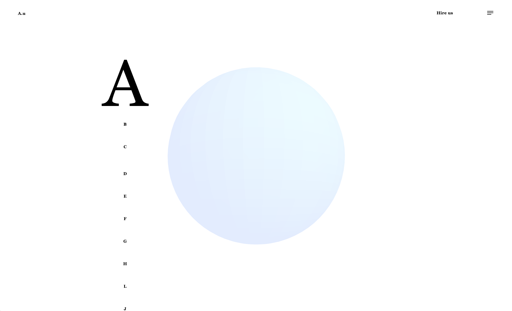

#A.u
This is project for getting started with Three.js on modern web development.

## Things covered

- [x] How to set install three.js
- [x] Three things for initial set up
      [] Renderer
      [] Scene
      [] Camera

  [] Light (Optional)

- [x] How to make canvas responsive on window resize
      [] Fix stretchy problem
      [] Fix low resolution

## Initial view

