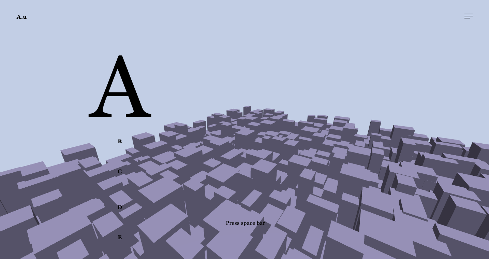
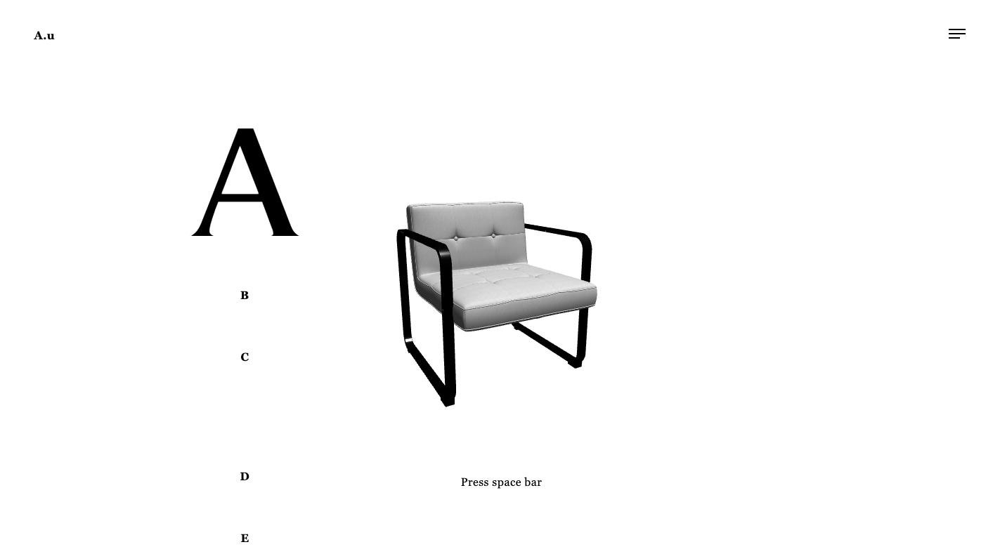
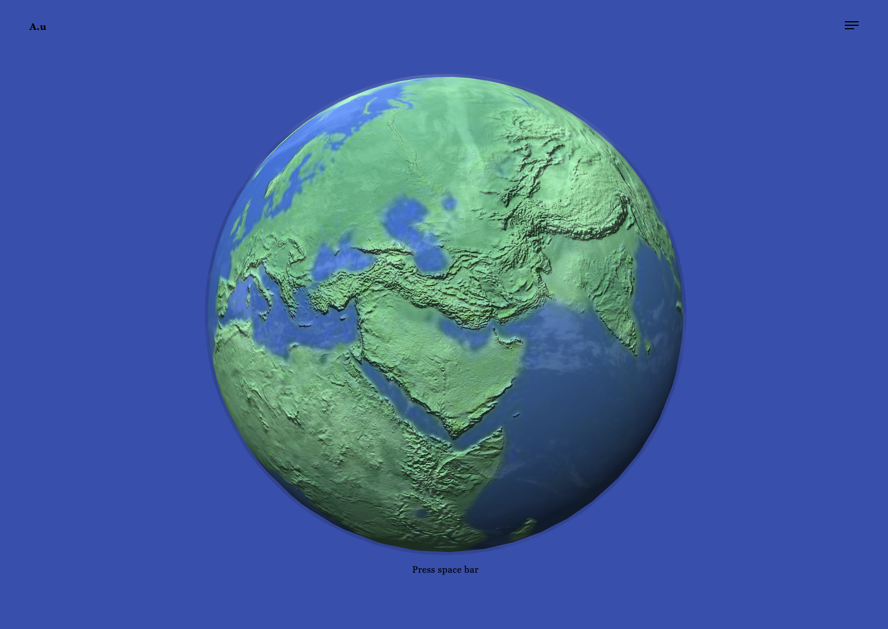

# A.u

This is the first project for getting started with Three.js.

### Things covered

#### Project 1

- [x] How to set install three.js
- [x] Three things for initial set up
  - [x] Renderer
  - [x] Scene
  - [x] Camera
  - [x] Light (Optional)
- [x] Three things for creating 3d geometry
  - [x] Geometry
  - [x] Material
  - [x] Mesh
- [x] How to make canvas responsive on window resize
  - [x] Fix stretchy problem
  - [x] Fix low resolution

#### Project 2

- [x] Add OrbitControls for interaction

#### Project 3

- [x] Load external 3d model

#### Project 4

Creating a globe

- [x] Texture mapping

## Screenshots

### Project 1

### Project 2

### Project 3

### Project 4

